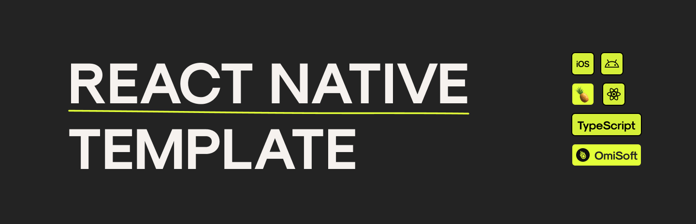

# 🍍 Pineapple React Native template

# 🐸 Dependencies 
- [Async Storage](https://www.npmjs.com/package/@react-native-async-storage/async-storage) - Key-value storage
- [React Native Keychain](https://www.npmjs.com/package/react-native-keychain) - Secure storage
- [React Navigation](https://reactnavigation.org/docs/getting-started/) - Navigation between screens & bottom tabs
- [React Navigation Devtools](https://reactnavigation.org/docs/devtools/) - Tools to debug navigation
- [Redux Toolkit](https://redux-toolkit.js.org/introduction/getting-started) - State manager & RTK queries
- [Axios](https://github.com/axios/axios) - Networking
- [Date-fns](https://date-fns.org) - Date utility
- [Formik](https://formik.org) - Build forms
- [Yup](https://github.com/jquense/yup) - Form validation
- [RNGH 2](https://www.npmjs.com/package/react-native-gesture-handler) - Gestures
- [Reanimated 2](https://docs.swmansion.com/react-native-reanimated/docs) - Animations
- [React Native Svg](https://github.com/react-native-svg/react-native-svg) - Create SVG
- [React Native Splash Screen](https://www.npmjs.com/package/react-native-splash-screen) - Splash screen

# 👨‍💻 Development dependencies 
- [Module Resolver](https://www.npmjs.com/package/babel-plugin-module-resolver) - Path aliases
- [SVG Transformer](https://github.com/kristerkari/react-native-svg-transformer) - Use SVG as components
- [RN Flipper](react-native-flipper) - Enable Flipper debugger

# 🙈 Setup

##  Main branch
1. Install dependencies & pods
<pre>
<code>npm i && cd ios && pod install</code>
</pre>
2. Build a project with XCode or Android Studio
3. Make some coffee while project is building☕️
4. Run Metro bundler (if it's not opened yet) and run an application 

## Core branch
1. Create a new project with TypeScript template:
<pre>
<code>npx react-native init AwesomeTSProject --template react-native-template-typescript</code>
</pre>
2. Move the files from this repository to a project we just created
3. [Configure splash screen for iOS & Android](https://www.npmjs.com/package/react-native-splash-screen)
4. [Configure react-navigation](https://reactnavigation.org/docs/getting-started/#installing-dependencies-into-a-bare-react-native-project)
5. [Configure Reanimated 2 for Android](https://docs.swmansion.com/react-native-reanimated/docs/fundamentals/installation#android)
6. Install dependencies
7. Install pods
8. Build a project with XCode or Android Studio

# 🐛 Debug 

This template is integrated with [Flipper](https://fbflipper.com) to debug an application

### Flipper plugins
- [react-navigation](https://reactnavigation.org/docs/devtools/)
- [redux-flipper](https://www.npmjs.com/package/redux-flipper)

# 📚 Useful resources

- [🌅 Splash screen & AppIcon generator](https://appicon.co)
- [🧬 Convert SVG to React Native component](https://react-svgr.com/playground/?native=true)

[![alt text][1.1]][1]
[![alt text][2.1]][2]

If you have any suggestions or questions feel free to make a Pull Request or contact us!

## Run by
[OmiSoft](https://omisoft.net/?utm_source=github&utm_medium=social)

[1]: http://www.twitter.com/omisoftnet
[2]: http://www.facebook.com/omisoftnet

[1.1]: http://i.imgur.com/wWzX9uB.png (twitter icon without padding)
[2.1]: http://i.imgur.com/fep1WsG.png (facebook icon without padding)

## License
Android Bluetooth Low Energy App is released under the MIT license.  
See the [LICENSE](./LICENSE.md) for details.